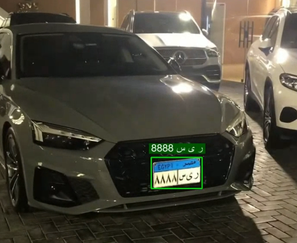
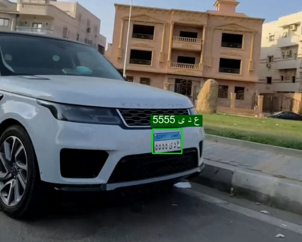

# 🚗 AI-Based Egyptian License Plate Detection & OCR System

An end-to-end **Computer Vision & Deep Learning system** for **Egyptian vehicle license plate detection and recognition**, built using **YOLOv11** for object detection and **PaddleOCR** for Arabic text recognition.

This project demonstrates a **real-world–ready pipeline** capable of processing **video streams**, performing **robust plate detection**, and extracting **Arabic characters and digits** with high accuracy and temporal stability.

---

## 📌 Motivation

License plate recognition in Egypt presents unique challenges:

* Arabic characters and Arabic numerals
* Diverse plate layouts and fonts
* Motion blur and low-resolution CCTV footage
* OCR instability across video frames

This project addresses these challenges by combining:

* A **high-accuracy detection model**
* **Tracking-aware OCR**
* **Post-processing and voting mechanisms**
  to produce stable and reliable results suitable for deployment.

---

## 🧩 System Pipeline

The complete pipeline consists of the following stages:

1. **Video Input**
2. **License Plate Detection (YOLOv11)**
3. **Multi-Object Tracking**
4. **Plate Cropping**
5. **Arabic OCR (PaddleOCR)**
6. **Digit Normalization (Arabic → English)**
7. **Character Filtering**
8. **Majority Voting Across Frames**
9. **Arabic Text Rendering**
10. **Annotated Video Output**

---

## 📂 Repository Structure

```bash
├── best.pt                 # Trained YOLOv11 model weights
├── car-plates.ipynb        # Training & evaluation notebook
├── Final_Output.ipynb      # OCR + video inference pipeline
├── requirements.txt        # Project dependencies
├── ARIAL.TTF               # Arabic font for correct text rendering
```

> ⚠️ All implementation is provided via **Jupyter Notebooks**, ensuring transparency and reproducibility.

---

## 🧠 Detection Model

### 🔹 Model Architecture

* **Model:** YOLOv11-Large
* **Framework:** Ultralytics
* **Task:** Object Detection
* **Class:** License Plate
* **Input Size:** 256 × 256

### 🔹 Training Environment

* **Platform:** Kaggle
* **GPU Acceleration:** Enabled
* **Automatic Mixed Precision (AMP):** Enabled

### 🔹 Training Strategy

* Fine-tuning from pretrained YOLOv11 weights
* Label smoothing to reduce overfitting
* Increased classification loss weight for confidence stability
* Optimized batch size for GPU memory efficiency

---

## 📊 Dataset

* **Source:** Roboflow
* **Annotations:** YOLO format
* **Split:** Train / Validation / Test
* **Content:** Egyptian vehicle license plates

🔗 **Dataset Link:**
**Roboflow Dataset**  
  [Egyptian License Plate Detection Dataset](https://app.roboflow.com/mohiey-mohamed/car-plates-detection-zu9wo-bwdsg/2)

Roboflow was used for:

* Dataset versioning
* Annotation management
* YOLO-compatible exports

---

## 📈 Training & Evaluation Results

### 🔹 Training Performance

| Metric    | Score  |
| --------- | ------ |
| Precision | 99.36% |
| Recall    | 99.23% |
| mAP@50    | 99.41% |
| mAP@50–95 | 90.03% |

### 🔹 Test Set Performance

| Metric    | Score      |
| --------- | ---------- |
| Precision | **99.94%** |
| Recall    | **99.49%** |
| mAP@50    | **99.50%** |
| mAP@50–95 | **91.04%** |

These metrics demonstrate:

* Strong generalization
* High localization accuracy
* Robust performance on unseen data

---

## 🔎 OCR Module

### 🔹 OCR Engine

* **Library:** PaddleOCR
* **Language Support:** Arabic
* **Angle Classification:** Enabled

### 🔹 OCR Enhancements

To improve recognition quality, the following techniques are applied:

* Plate image upscaling before OCR
* Arabic digit normalization (٠ → 0, ١ → 1, etc.)
* Regex-based numeric extraction
* Blacklisting ambiguous Arabic characters
* Length validation for Egyptian plate formats

---

## 🎥 Video-Based Inference

📘 **Notebook:** `Final_Output.ipynb`

### 🔹 Key Capabilities

* Real-time plate detection
* Object tracking to maintain plate identity
* Frame-by-frame OCR extraction
* Majority voting to stabilize predictions
* Arabic text rendering using a custom font

### 🔹 Stability via Majority Voting

OCR results are accumulated per tracked plate ID, and the most frequent prediction is selected, significantly reducing flickering and misreads.

---

## 🖋️ Arabic Text Rendering

* **Font:** ARIAL.TTF
* **Rendering Method:** PIL + Bidi algorithm
* **Purpose:** Correct right-to-left Arabic visualization inside OpenCV frames

This ensures visually correct overlays for Arabic license plates.

---
## 🧪 Inference Results (Visual Examples)

Below are sample results demonstrating license plate detection and Arabic OCR performance on real-world video frames.

### 🔹 Sample Result 1


### 🔹 Sample Result 2



## ⚙️ Installation

### 1️⃣ Clone the repository

```bash
git clone https://github.com/mohieyelkiouty/Egyptian-License-Plate-Detection.git
```

### 2️⃣ Install dependencies

```bash
pip install -r requirements.txt
```

> All required libraries are listed explicitly to ensure reproducibility.

---

## 🚀 Applications

This system can be adapted for:

* Intelligent Traffic Systems (ITS)
* Smart City Surveillance
* Automated Parking Systems
* Toll Gate Automation
* Law Enforcement & Vehicle Monitoring

---

## 🔬 Design Highlights

* Modular notebook-based design
* Real-time capable inference
* Language-aware OCR pipeline
* Deployment-ready logic
* Dataset-driven training workflow

---

## 🔗 References & Trusted Sources

* **Ultralytics YOLO Documentation:**  
  [docs.ultralytics.com](https://docs.ultralytics.com)

* **PaddleOCR – Official Repository:**  
  [PaddlePaddle / PaddleOCR](https://github.com/PaddlePaddle/PaddleOCR)

* **Roboflow – Dataset Management Platform:**  
  [roboflow.com](https://roboflow.com)

* **OpenCV – Computer Vision Library:**  
  [opencv.org](https://opencv.org)

These references are widely used and trusted in production-grade computer vision systems.

---

## 👤 Author

**Mohiey Elkiouty**

* **LinkedIn:**
  [Mohiey Elkiouty](https://www.linkedin.com/in/mohiey-elkiouty/)

* **Project Post Reference:**
  [AI-Based Egyptian License Plate Detection System](https://www.linkedin.com/posts/mohiey-elkiouty_ai-based-egyptian-license-plate-detection-activity-7414052568789864448-wqCn?utm_source=share&utm_medium=member_desktop&rcm=ACoAAEAGap8B5xAekBSu7q3PrLdW9Igu1v7iQ4Q)

---

## ⭐ Support

If you find this project useful:

* ⭐ Star the repository
* 🔁 Share it with the community
* 🤝 Connect on LinkedIn
